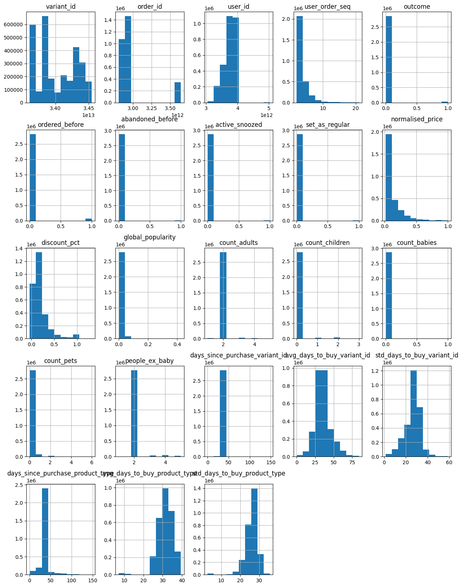
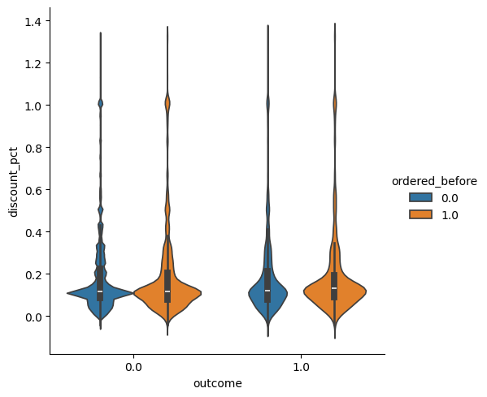
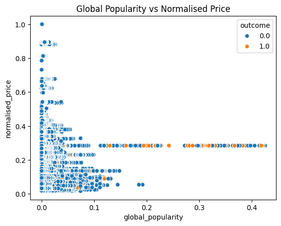

# 2. Exploratory Data Analysis

I tried to extract “sampled_box_builder.csv” using *cp* and *sync* but was unsuccessful.

Finally, I used *sync* from “/groceries/box_builder_dataset,” from where I downloaded “feature_frame.csv.”


```python
import pandas as pd
import numpy as np
import matplotlib.pyplot as plt
import seaborn as sns
```


```python
df_features = pd.read_csv("../../data/raw/feature_frame.csv")

df_features.info(show_counts=True)
```

    <class 'pandas.DataFrame'>
    RangeIndex: 2880549 entries, 0 to 2880548
    Data columns (total 27 columns):
     #   Column                            Non-Null Count    Dtype  
    ---  ------                            --------------    -----  
     0   variant_id                        2880549 non-null  int64  
     1   product_type                      2880549 non-null  str    
     2   order_id                          2880549 non-null  int64  
     3   user_id                           2880549 non-null  int64  
     4   created_at                        2880549 non-null  str    
     5   order_date                        2880549 non-null  str    
     6   user_order_seq                    2880549 non-null  int64  
     7   outcome                           2880549 non-null  float64
     8   ordered_before                    2880549 non-null  float64
     9   abandoned_before                  2880549 non-null  float64
     10  active_snoozed                    2880549 non-null  float64
     11  set_as_regular                    2880549 non-null  float64
     12  normalised_price                  2880549 non-null  float64
     13  discount_pct                      2880549 non-null  float64
     14  vendor                            2880549 non-null  str    
     15  global_popularity                 2880549 non-null  float64
     16  count_adults                      2880549 non-null  float64
     17  count_children                    2880549 non-null  float64
     18  count_babies                      2880549 non-null  float64
     19  count_pets                        2880549 non-null  float64
     20  people_ex_baby                    2880549 non-null  float64
     21  days_since_purchase_variant_id    2880549 non-null  float64
     22  avg_days_to_buy_variant_id        2880549 non-null  float64
     23  std_days_to_buy_variant_id        2880549 non-null  float64
     24  days_since_purchase_product_type  2880549 non-null  float64
     25  avg_days_to_buy_product_type      2880549 non-null  float64
     26  std_days_to_buy_product_type      2880549 non-null  float64
    dtypes: float64(19), int64(4), str(4)
    memory usage: 760.2 MB


We have 27 variables, the vast majority of which are numerical (which will facilitate the use of models), and those that are not can perhaps be transformed into numerical (continuous or discrete) if necessary and if they add value to the possible use cases.

It would be interesting to define the meaning of the variable (since, for the use case, we do not know the origin of the dataset).

#### Definition of variables:

- variant_id : unique identifier
- product_type : type of product (category)
- created_at : creation date
- order_date : order date
- user_order_seq : order number (per user)
- outcome : event indicator (binary)
- ordered_before : previously ordered (history) (binary)
- abandoned_before : previously abandoned order (binary)
- active_snoozed : user on pause or inactive (binary)
- set_as_regular : marked as fair (binary)
- normalised_price : standard price
- discount_pct : discount applied


```python
df_features.head()
```


<div>
<style scoped>
    .dataframe tbody tr th:only-of-type {
        vertical-align: middle;
    }

    .dataframe tbody tr th {
        vertical-align: top;
    }

    .dataframe thead th {
        text-align: right;
    }
</style>
<table border="1" class="dataframe">
  <thead>
    <tr style="text-align: right;">
      <th></th>
      <th>variant_id</th>
      <th>product_type</th>
      <th>order_id</th>
      <th>user_id</th>
      <th>created_at</th>
      <th>order_date</th>
      <th>user_order_seq</th>
      <th>outcome</th>
      <th>ordered_before</th>
      <th>abandoned_before</th>
      <th>...</th>
      <th>count_children</th>
      <th>count_babies</th>
      <th>count_pets</th>
      <th>people_ex_baby</th>
      <th>days_since_purchase_variant_id</th>
      <th>avg_days_to_buy_variant_id</th>
      <th>std_days_to_buy_variant_id</th>
      <th>days_since_purchase_product_type</th>
      <th>avg_days_to_buy_product_type</th>
      <th>std_days_to_buy_product_type</th>
    </tr>
  </thead>
  <tbody>
    <tr>
      <th>0</th>
      <td>33826472919172</td>
      <td>ricepastapulses</td>
      <td>2807985930372</td>
      <td>3482464092292</td>
      <td>2020-10-05 16:46:19</td>
      <td>2020-10-05 00:00:00</td>
      <td>3</td>
      <td>0.0</td>
      <td>0.0</td>
      <td>0.0</td>
      <td>...</td>
      <td>0.0</td>
      <td>0.0</td>
      <td>0.0</td>
      <td>2.0</td>
      <td>33.0</td>
      <td>42.0</td>
      <td>31.134053</td>
      <td>30.0</td>
      <td>30.0</td>
      <td>24.27618</td>
    </tr>
    <tr>
      <th>1</th>
      <td>33826472919172</td>
      <td>ricepastapulses</td>
      <td>2808027644036</td>
      <td>3466586718340</td>
      <td>2020-10-05 17:59:51</td>
      <td>2020-10-05 00:00:00</td>
      <td>2</td>
      <td>0.0</td>
      <td>0.0</td>
      <td>0.0</td>
      <td>...</td>
      <td>0.0</td>
      <td>0.0</td>
      <td>0.0</td>
      <td>2.0</td>
      <td>33.0</td>
      <td>42.0</td>
      <td>31.134053</td>
      <td>30.0</td>
      <td>30.0</td>
      <td>24.27618</td>
    </tr>
    <tr>
      <th>2</th>
      <td>33826472919172</td>
      <td>ricepastapulses</td>
      <td>2808099078276</td>
      <td>3481384026244</td>
      <td>2020-10-05 20:08:53</td>
      <td>2020-10-05 00:00:00</td>
      <td>4</td>
      <td>0.0</td>
      <td>0.0</td>
      <td>0.0</td>
      <td>...</td>
      <td>0.0</td>
      <td>0.0</td>
      <td>0.0</td>
      <td>2.0</td>
      <td>33.0</td>
      <td>42.0</td>
      <td>31.134053</td>
      <td>30.0</td>
      <td>30.0</td>
      <td>24.27618</td>
    </tr>
    <tr>
      <th>3</th>
      <td>33826472919172</td>
      <td>ricepastapulses</td>
      <td>2808393957508</td>
      <td>3291363377284</td>
      <td>2020-10-06 08:57:59</td>
      <td>2020-10-06 00:00:00</td>
      <td>2</td>
      <td>0.0</td>
      <td>0.0</td>
      <td>0.0</td>
      <td>...</td>
      <td>0.0</td>
      <td>0.0</td>
      <td>0.0</td>
      <td>2.0</td>
      <td>33.0</td>
      <td>42.0</td>
      <td>31.134053</td>
      <td>30.0</td>
      <td>30.0</td>
      <td>24.27618</td>
    </tr>
    <tr>
      <th>4</th>
      <td>33826472919172</td>
      <td>ricepastapulses</td>
      <td>2808429314180</td>
      <td>3537167515780</td>
      <td>2020-10-06 10:37:05</td>
      <td>2020-10-06 00:00:00</td>
      <td>3</td>
      <td>0.0</td>
      <td>0.0</td>
      <td>0.0</td>
      <td>...</td>
      <td>0.0</td>
      <td>0.0</td>
      <td>0.0</td>
      <td>2.0</td>
      <td>33.0</td>
      <td>42.0</td>
      <td>31.134053</td>
      <td>30.0</td>
      <td>30.0</td>
      <td>24.27618</td>
    </tr>
  </tbody>
</table>
<p>5 rows × 27 columns</p>
</div>


```python
df_features.describe().transpose()
```


<div>
<style scoped>
    .dataframe tbody tr th:only-of-type {
        vertical-align: middle;
    }

    .dataframe tbody tr th {
        vertical-align: top;
    }

    .dataframe thead th {
        text-align: right;
    }
</style>
<table border="1" class="dataframe">
  <thead>
    <tr style="text-align: right;">
      <th></th>
      <th>count</th>
      <th>mean</th>
      <th>std</th>
      <th>min</th>
      <th>25%</th>
      <th>50%</th>
      <th>75%</th>
      <th>max</th>
    </tr>
  </thead>
  <tbody>
    <tr>
      <th>variant_id</th>
      <td>2880549.0</td>
      <td>3.401250e+13</td>
      <td>2.786246e+11</td>
      <td>3.361529e+13</td>
      <td>3.380354e+13</td>
      <td>3.397325e+13</td>
      <td>3.428495e+13</td>
      <td>3.454300e+13</td>
    </tr>
    <tr>
      <th>order_id</th>
      <td>2880549.0</td>
      <td>2.978388e+12</td>
      <td>2.446292e+11</td>
      <td>2.807986e+12</td>
      <td>2.875152e+12</td>
      <td>2.902856e+12</td>
      <td>2.922034e+12</td>
      <td>3.643302e+12</td>
    </tr>
    <tr>
      <th>user_id</th>
      <td>2880549.0</td>
      <td>3.750025e+12</td>
      <td>1.775710e+11</td>
      <td>3.046041e+12</td>
      <td>3.745901e+12</td>
      <td>3.812775e+12</td>
      <td>3.874925e+12</td>
      <td>5.029635e+12</td>
    </tr>
    <tr>
      <th>user_order_seq</th>
      <td>2880549.0</td>
      <td>3.289342e+00</td>
      <td>2.140176e+00</td>
      <td>2.000000e+00</td>
      <td>2.000000e+00</td>
      <td>3.000000e+00</td>
      <td>4.000000e+00</td>
      <td>2.100000e+01</td>
    </tr>
    <tr>
      <th>outcome</th>
      <td>2880549.0</td>
      <td>1.153669e-02</td>
      <td>1.067876e-01</td>
      <td>0.000000e+00</td>
      <td>0.000000e+00</td>
      <td>0.000000e+00</td>
      <td>0.000000e+00</td>
      <td>1.000000e+00</td>
    </tr>
    <tr>
      <th>ordered_before</th>
      <td>2880549.0</td>
      <td>2.113868e-02</td>
      <td>1.438466e-01</td>
      <td>0.000000e+00</td>
      <td>0.000000e+00</td>
      <td>0.000000e+00</td>
      <td>0.000000e+00</td>
      <td>1.000000e+00</td>
    </tr>
    <tr>
      <th>abandoned_before</th>
      <td>2880549.0</td>
      <td>6.092589e-04</td>
      <td>2.467565e-02</td>
      <td>0.000000e+00</td>
      <td>0.000000e+00</td>
      <td>0.000000e+00</td>
      <td>0.000000e+00</td>
      <td>1.000000e+00</td>
    </tr>
    <tr>
      <th>active_snoozed</th>
      <td>2880549.0</td>
      <td>2.290188e-03</td>
      <td>4.780109e-02</td>
      <td>0.000000e+00</td>
      <td>0.000000e+00</td>
      <td>0.000000e+00</td>
      <td>0.000000e+00</td>
      <td>1.000000e+00</td>
    </tr>
    <tr>
      <th>set_as_regular</th>
      <td>2880549.0</td>
      <td>3.629864e-03</td>
      <td>6.013891e-02</td>
      <td>0.000000e+00</td>
      <td>0.000000e+00</td>
      <td>0.000000e+00</td>
      <td>0.000000e+00</td>
      <td>1.000000e+00</td>
    </tr>
    <tr>
      <th>normalised_price</th>
      <td>2880549.0</td>
      <td>1.272808e-01</td>
      <td>1.268378e-01</td>
      <td>1.599349e-02</td>
      <td>5.394416e-02</td>
      <td>8.105178e-02</td>
      <td>1.352670e-01</td>
      <td>1.000000e+00</td>
    </tr>
    <tr>
      <th>discount_pct</th>
      <td>2880549.0</td>
      <td>1.862744e-01</td>
      <td>1.934480e-01</td>
      <td>-4.016064e-02</td>
      <td>8.462238e-02</td>
      <td>1.169176e-01</td>
      <td>2.234637e-01</td>
      <td>1.325301e+00</td>
    </tr>
    <tr>
      <th>global_popularity</th>
      <td>2880549.0</td>
      <td>1.070302e-02</td>
      <td>1.663389e-02</td>
      <td>0.000000e+00</td>
      <td>1.628664e-03</td>
      <td>6.284368e-03</td>
      <td>1.418440e-02</td>
      <td>4.254386e-01</td>
    </tr>
    <tr>
      <th>count_adults</th>
      <td>2880549.0</td>
      <td>2.017627e+00</td>
      <td>2.098915e-01</td>
      <td>1.000000e+00</td>
      <td>2.000000e+00</td>
      <td>2.000000e+00</td>
      <td>2.000000e+00</td>
      <td>5.000000e+00</td>
    </tr>
    <tr>
      <th>count_children</th>
      <td>2880549.0</td>
      <td>5.492182e-02</td>
      <td>3.276586e-01</td>
      <td>0.000000e+00</td>
      <td>0.000000e+00</td>
      <td>0.000000e+00</td>
      <td>0.000000e+00</td>
      <td>3.000000e+00</td>
    </tr>
    <tr>
      <th>count_babies</th>
      <td>2880549.0</td>
      <td>3.538562e-03</td>
      <td>5.938048e-02</td>
      <td>0.000000e+00</td>
      <td>0.000000e+00</td>
      <td>0.000000e+00</td>
      <td>0.000000e+00</td>
      <td>1.000000e+00</td>
    </tr>
    <tr>
      <th>count_pets</th>
      <td>2880549.0</td>
      <td>5.134091e-02</td>
      <td>3.013646e-01</td>
      <td>0.000000e+00</td>
      <td>0.000000e+00</td>
      <td>0.000000e+00</td>
      <td>0.000000e+00</td>
      <td>6.000000e+00</td>
    </tr>
    <tr>
      <th>people_ex_baby</th>
      <td>2880549.0</td>
      <td>2.072549e+00</td>
      <td>3.943659e-01</td>
      <td>1.000000e+00</td>
      <td>2.000000e+00</td>
      <td>2.000000e+00</td>
      <td>2.000000e+00</td>
      <td>5.000000e+00</td>
    </tr>
    <tr>
      <th>days_since_purchase_variant_id</th>
      <td>2880549.0</td>
      <td>3.312961e+01</td>
      <td>3.707162e+00</td>
      <td>0.000000e+00</td>
      <td>3.300000e+01</td>
      <td>3.300000e+01</td>
      <td>3.300000e+01</td>
      <td>1.480000e+02</td>
    </tr>
    <tr>
      <th>avg_days_to_buy_variant_id</th>
      <td>2880549.0</td>
      <td>3.523734e+01</td>
      <td>1.057766e+01</td>
      <td>0.000000e+00</td>
      <td>3.000000e+01</td>
      <td>3.400000e+01</td>
      <td>4.000000e+01</td>
      <td>8.400000e+01</td>
    </tr>
    <tr>
      <th>std_days_to_buy_variant_id</th>
      <td>2880549.0</td>
      <td>2.645304e+01</td>
      <td>7.168323e+00</td>
      <td>1.414214e+00</td>
      <td>2.319372e+01</td>
      <td>2.769305e+01</td>
      <td>3.059484e+01</td>
      <td>5.868986e+01</td>
    </tr>
    <tr>
      <th>days_since_purchase_product_type</th>
      <td>2880549.0</td>
      <td>3.143513e+01</td>
      <td>1.227511e+01</td>
      <td>0.000000e+00</td>
      <td>3.000000e+01</td>
      <td>3.000000e+01</td>
      <td>3.000000e+01</td>
      <td>1.480000e+02</td>
    </tr>
    <tr>
      <th>avg_days_to_buy_product_type</th>
      <td>2880549.0</td>
      <td>3.088810e+01</td>
      <td>4.330262e+00</td>
      <td>7.000000e+00</td>
      <td>2.800000e+01</td>
      <td>3.100000e+01</td>
      <td>3.400000e+01</td>
      <td>3.950000e+01</td>
    </tr>
    <tr>
      <th>std_days_to_buy_product_type</th>
      <td>2880549.0</td>
      <td>2.594969e+01</td>
      <td>3.278860e+00</td>
      <td>2.828427e+00</td>
      <td>2.427618e+01</td>
      <td>2.608188e+01</td>
      <td>2.796118e+01</td>
      <td>3.564191e+01</td>
    </tr>
  </tbody>
</table>
</div>


```python
df_features.nunique()
```


    variant_id                           976
    product_type                          62
    order_id                            3446
    user_id                             1937
    created_at                          3446
    order_date                           149
    user_order_seq                        20
    outcome                                2
    ordered_before                         2
    abandoned_before                       2
    active_snoozed                         2
    set_as_regular                         2
    normalised_price                     127
    discount_pct                         526
    vendor                               264
    global_popularity                   5968
    count_adults                           5
    count_children                         4
    count_babies                           2
    count_pets                             5
    people_ex_baby                         5
    days_since_purchase_variant_id       142
    avg_days_to_buy_variant_id           122
    std_days_to_buy_variant_id           819
    days_since_purchase_product_type     141
    avg_days_to_buy_product_type          26
    std_days_to_buy_product_type          61
    dtype: int64


```python
df_features.duplicated().sum()
```


    np.int64(0)


```python
df_features["outcome"].value_counts(normalize=True)
```


    outcome
    0.0    0.988463
    1.0    0.011537
    Name: proportion, dtype: float64


We have a very unbalanced dataset for one of the events. If we set 0 as “no” (which would be the most logical), most orders were not completed.

### Analisys


```python
df_features[df_features["outcome"] == 1]["product_type"].value_counts(normalize=True).head(10)
```


    product_type
    tinspackagedfoods           0.133877
    longlifemilksubstitutes     0.054496
    snacksconfectionery         0.052540
    ricepastapulses             0.046190
    cereal                      0.045829
    condimentsdressings         0.045318
    cookingingredientsoils      0.043873
    dishwasherdetergent         0.043362
    bathroomlimescalecleaner    0.036982
    homebaking                  0.033040
    Name: proportion, dtype: float64


```python
df_features[df_features["outcome"] == 1]["vendor"].value_counts(normalize=True).head(15)
```


    vendor
    biona               0.067616
    oatly               0.043603
    ecover              0.039751
    method              0.037313
    treeoflife          0.028978
    heinz               0.025397
    mutti               0.020552
    tonyschocolonely    0.018235
    cooksco             0.017965
    clearspring         0.013541
    thecheekypanda      0.013361
    symphony            0.013361
    tatelyle            0.013361
    plenty              0.013270
    finish              0.012729
    Name: proportion, dtype: float64


```python
df_features[df_features["ordered_before"] == 1]["outcome"].value_counts(normalize=True)
```


    outcome
    0.0    0.835033
    1.0    0.164967
    Name: proportion, dtype: float64


```python
df_features["discount_pct"].value_counts().sort_index()
```


    discount_pct
    -0.040161     1587
     0.000000     2367
     0.000953      430
     0.001252     4032
     0.001541      844
                 ...  
     1.010101     6892
     1.013423    17230
     1.020202     3446
     1.132075     3446
     1.325301     3446
    Name: count, Length: 526, dtype: int64


They cannot be base percentage discounts, as some exceed 100%, so they are likely to be applied to another price.

- Possible interpretations negative discount:

    The price increased compared to the base price.

    Discount calculation error.

    Difference between historical price and current price.

    Error or a discount greater than the purchase price (applied by a voucher or promotion). 


```python
df_features["discount_pct"].describe()
```


    count    2.880549e+06
    mean     1.862744e-01
    std      1.934480e-01
    min     -4.016064e-02
    25%      8.462238e-02
    50%      1.169176e-01
    75%      2.234637e-01
    max      1.325301e+00
    Name: discount_pct, dtype: float64


```python
df_features[(df_features["ordered_before"] == 1) & (df_features["discount_pct"] < 0.0)]["outcome"].value_counts(normalize=True)
```


    outcome
    0.0    0.692308
    1.0    0.307692
    Name: proportion, dtype: float64


```python
df_features[(df_features["ordered_before"] == 1) & (df_features["discount_pct"] > 1.3)]["outcome"].value_counts(normalize=True)
```


    outcome
    0.0    0.745098
    1.0    0.254902
    Name: proportion, dtype: float64


```python
df_features[(df_features["ordered_before"] == 1) & (df_features["discount_pct"] > 1.2) & (df_features["count_children"] > 0)]["outcome"].value_counts(normalize=True)
```


    outcome
    1.0    0.529412
    0.0    0.470588
    Name: proportion, dtype: float64


```python
df_features[(df_features["ordered_before"] == 1) & (df_features["discount_pct"] > 0) & (df_features["count_children"] > 0)]["outcome"].value_counts(normalize=True)
```


    outcome
    0.0    0.839407
    1.0    0.160593
    Name: proportion, dtype: float64


### Representations


```python
df_features.hist(figsize=(15, 20))
plt.show()
```


    

    


```python
sns.catplot(data=df_features, x="outcome", y="discount_pct", kind="violin", hue="ordered_before")
```


    <seaborn.axisgrid.FacetGrid at 0x7ff8844f5850>


    

    


```python
sns.scatterplot(data=df_features, x="global_popularity", y="normalised_price", hue="outcome")
plt.title("Global Popularity vs Normalised Price")
plt.show()
```

    /home/diego/zrive-ds/.venv/lib/python3.11/site-packages/IPython/core/pylabtools.py:170: UserWarning: Creating legend with loc="best" can be slow with large amounts of data.
      fig.canvas.print_figure(bytes_io, **kw)


    

    


### Insights:

1. The target variable *outcome* is highly imbalanced.
2. Regular customers aren't swayed by discounts.
3. High discounts do not guarantee higher conversion rates.
4. Customers with children are more likely to be swayed by discounts.
5. Products with small discounts that are added to the cart for the first time are abandoned more frequently.
6. The majority of abandoned items are less popular and have a lower average price.
